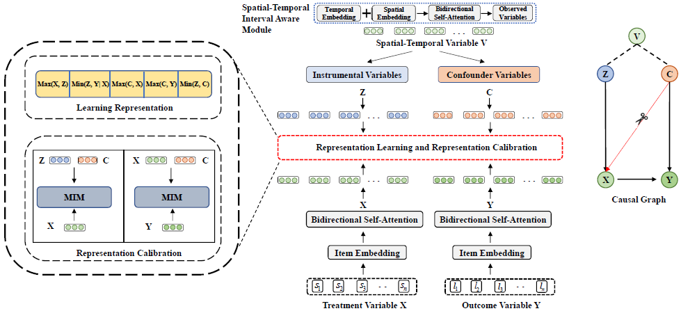

# IVDN

IVDN: Instrumental Variable Decomposition Network for Next POI Recommendation

 


# References


# Requirements

+ python >= 3.6
+ pytorch == 1.10.1
+ torchtext == 0.6.0

# Datasets

IVDN is implemented on the public LBSN datasets.

[Brightkite](https://snap.stanford.edu/data/loc-brightkite.html)

Before running we need to put the dataset folder into the dataset folder path.


# Train and Test

- After downloading the dataset we run the program using the following command. We can also modify the necessary parameters in the run.sh script. The run.sh script contains commands to start the program for both pre-training and fine-tuning.
  
  ```shell   
  bash run.sh
  ```

  
  

